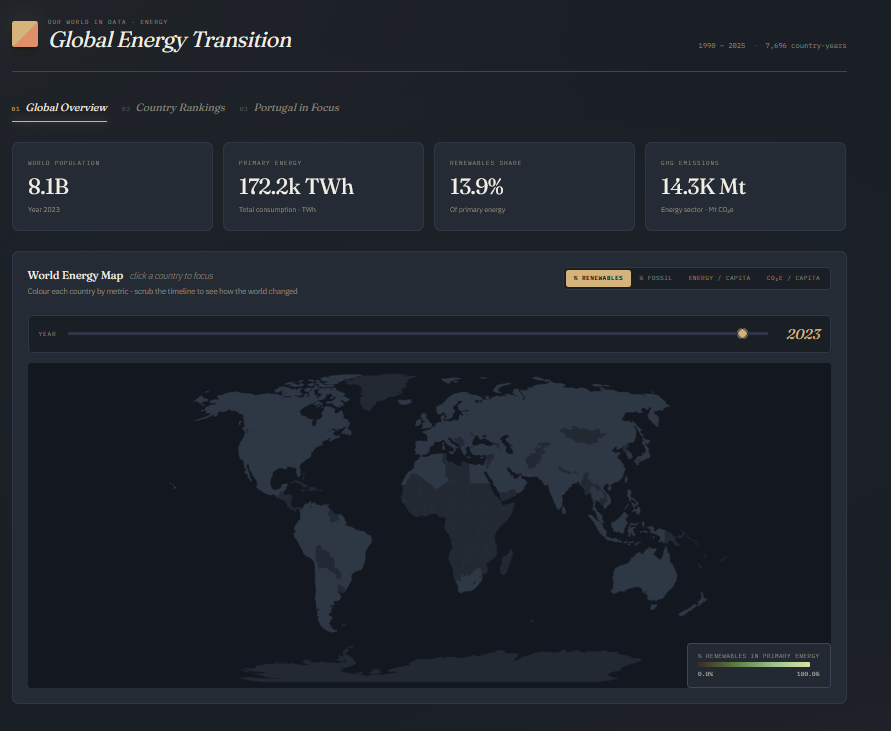
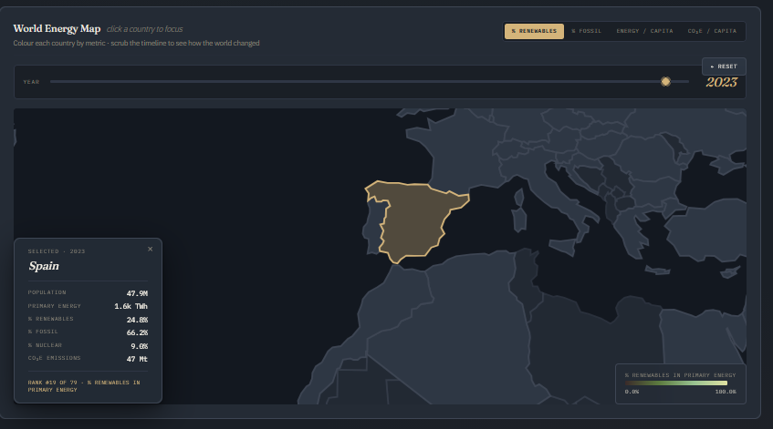
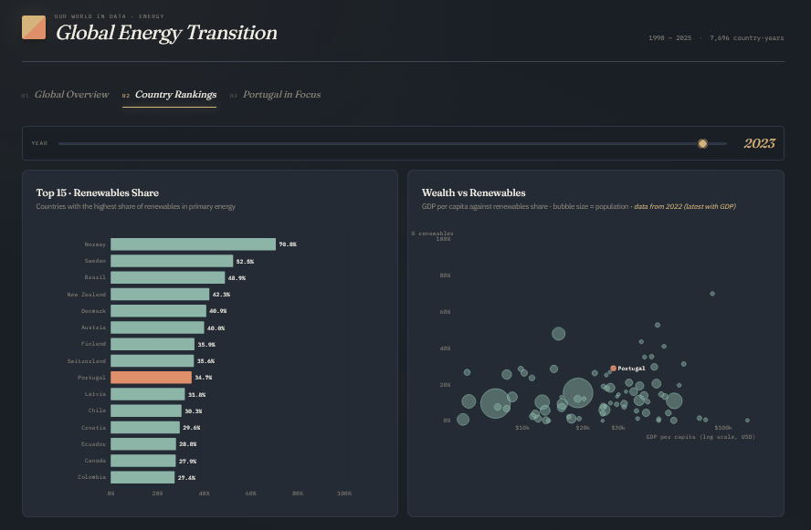
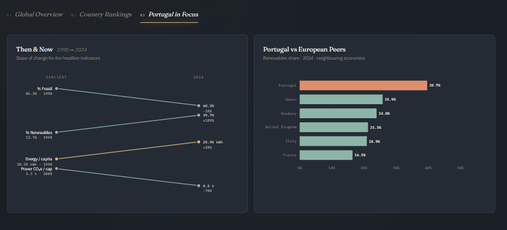

# SVDC - Visualization Exercise

**Mestrado em Inteligência Artificial | Universidade do Minho**  

## 📌 Introdução
O propósito deste exercício é aplicar os conceitos e técnicas lecionados na unidade curricular a um dataset do mundo real. O objetivo é realizar uma análise exploratória dos dados e criar visualizações para comunicar descobertas de forma eficaz, revelando padrões que possam informar a tomada de decisão.

**Dataset escolhido:** Energy dataset (`owid-energy-data.csv`).

## 🚀 Como reproduzir e executar o projeto

Para visualizar este projeto localmente:

1. **Pré-processamento dos Dados (Opcional):** 
   ```bash
   python limpeza_dados.py
   ```

2. **Iniciar o Servidor Local:**
   ```bash
   python -m http.server
   ```

3. **Visualizar:**
   Abrir o navegador e aceder ao endereço http://localhost:8000.


## 🛠️ Pré-processamento
Para preparar os dados para visualização (neste caso, usando d3.js), foram aplicados os seguintes passos de transformação no dataset original:

1. **Separação de Entidades:** O dataset original mistura países e agregados regionais na mesma coluna. Foi criada uma distinção baseada na coluna `iso_code`: registos com o código vazio (nulo) foram separados como Regiões, e os restantes mantidos como Países.
2. **Remoção de Fontes Parciais:** Foram removidas linhas referentes a fontes de dados específicas (entidades com sufixos como `Ember`, `EI`, `EIA` ou `Shift`), pois apresentam demasiados valores nulos nas colunas demográficas (como população e PIB), o que inviabiliza cálculos per capita, para além de existirem dados repetidos, o que inviabiliza a visualização dos dados.
3. **Filtragem Temporal:** Para lidar com a ausência de dados históricos em energias mais recentes (ex: solar, eólica), os dados foram filtrados para incluir apenas os registos a partir do ano 1990.

*(Nota: O script de transformação e os dados limpos encontram-se disponíveis neste repositório para reprodução do trabalho)*

## Objetivo de cada gráfico
1. KPIs (Tab 01) — fotografia rápida do estado energético mundial no ano escolhido: população, consumo total, % renováveis, emissões. Ancora a escala antes do leitor explorar o mapa.
2. Mapa coroplético mundial (Tab 01) — revelar padrões geográficos do mix energético. Onde está a transição mais avançada, onde persiste o fóssil, como varia a energia per capita e as emissões. O slider de ano dá a evolução temporal; o toggle troca a lente analítica sem mudar de gráfico.
3. Top 15 · Renewables Share (Tab 02) — comparação direta de quem lidera em % de renováveis no mix primário. Permite ver de relance onde Portugal se posiciona globalmente.
4. Wealth vs Renewables (Tab 02) — testar a hipótese intuitiva de que países ricos são necessariamente mais verdes. O scatter quebra a correlação simplista: Noruega (rica + verde) vs Arábia Saudita (rica + fóssil); Brasil (menos rica + verde). A riqueza explica menos do que se esperava.
5. Slope chart "Then & Now" (Tab 03) — quantificar a magnitude e direção da transição em Portugal entre o ano-base disponível e 2024, em quatro indicadores-chave (% fóssil, % renováveis, energia/capita, CO₂e/capita do setor elétrico). Lê-se de relance: o indicador subiu ou desceu, e por quanto.
6. Portugal vs European Peers (Tab 03) — posicionar Portugal face aos vizinhos europeus. Mostra que Portugal lidera em renováveis face a Espanha, França, Alemanha, Reino Unido e Itália.

## 📊 Resultados

Abaixo apresentam-se as visualizações interativas desenvolvidas em D3.js, divididas em três abas de análise distintas:

### 1. [Aba1-Global Overview]
*(Breve frase a explicar o que o gráfico mostra, ex: Evolução do consumo de energias renováveis vs fósseis desde 1990).*




### 2. [Aba2-Country Rankings]
*(Breve frase a explicar o que o gráfico mostra, ex: Relação entre o PIB per capita e a pegada de carbono por país).*



### 3. [Aba3-Portugal in Focus]
*(Breve frase a explicar o que o gráfico mostra, ex: Análise detalhada do panorama energético de Portugal).*




Resumo por aba
01 · Global Overview — panorama mundial. Vê-se a escala (KPIs) e explora-se a distribuição geográfica das métricas energéticas. Interativo via slider de ano, toggle de métrica, e click-to-zoom em qualquer país para abrir o cartão com o perfil detalhado.
02 · Country Rankings — comparação entre países. Ranking dos líderes em renováveis + scatter riqueza-vs-renováveis, ambos coordenados pelo mesmo slider de ano.
03 · Portugal in Focus — foco no caso português. Slope chart da transição ao longo de ~35 anos + posicionamento face aos peers europeus em 2024.